Advanced User Guide
===================

Software Stack Overview
***********************

PyBuda is largely divided into two main components, the compiler and the runtime.  Below is an overview of each component respectively.

PyBuda Compiler Architecture
----------------------------

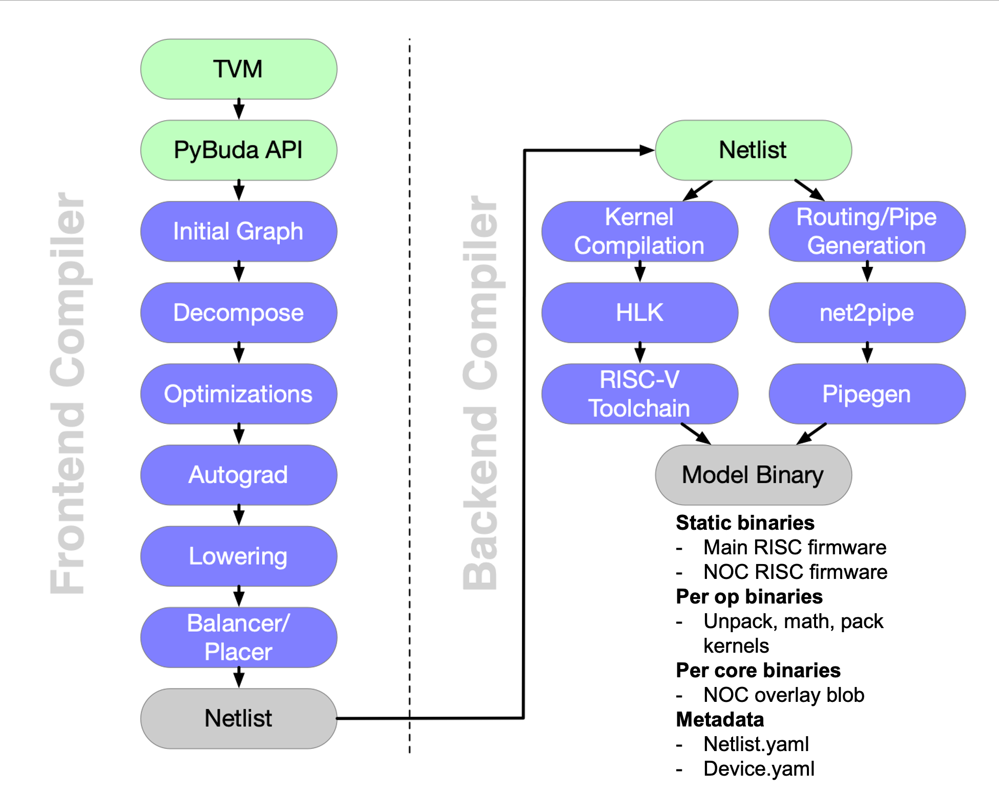

The PyBuda compiler is largely broken into 2 halves, frontend and backend as depicted in the image above.  Each piece respectively is organized in passes that iteratively transform the framework model into something executable by the hardware.

**Frontend Passes**

* **TVM**: PyBuda is itself an ML framework, but typically it's more convenient to run models that have already been written to target another framework.  We use TVM to abstract our compiler over many popular frameworks so it is often the primary entry point.  We've written and maintain a TVM backend that targets PyBuda API.
* **PyBuda API**: It's also possible to express your model directly in PyBuda.  Most internal tests are written directly in PyBuda.
* **Initial Graph**: This isn't really a compile pass, but rather an execution trace of the model with dummy tensors.  From this trace we are able to build a rich graph datastructure that the frontend compiler uses to perform transformations over.
* **Decompose**: This pass allows us to implement high level ops, such as ``softmax`` in terms of lower level ops.  Decomposition in this context is breaking apart high level ops and replacing them in the graph with a new subgraph that implements the original op.  This pass calls top level hooks into python making it very easy to add new decompositions into the compiler.
* **Optimizations**: This is a collection of passes that perform many kinds of optimizations including constant folding, op reordering, and reshape cancelation.
* **Autograd**: We have our own autograd pass which gives us the opportunity to annotate our graph datastructure in a way to help future passes best target our HW.  With this information our placement pass can leverage some unique properties about TT architecture to make training more efficient.  This pass is only enabled if training is enabled.
* **Lowering**: Up until this point we've been using operators in a high level IR that we call PyBuda IR.  Lowering does a few things, but it's main purpose is to lower this high level IR (PyBuda IR) to a low level IR (Buda IR) where this Buda IR is the core set of operations that are backed by HW kernels implemented by our backend compiler.  Lowering is also where we perform data format selection and snap tensor sizes to tile granularity (i.e. 32x32 multiples on the RxC dims).
* **Balancer/Placer**: Finally, our graph is ready to be scheduled onto the HW.  Balancer and Placer are tightly coupled datastructures that together determine how operations will be laid out onto the device core grid and how many resources to assign to each operation.
* **Netlist**: Netlist is the intermediate representation that serves as the API boundary between the frontend and the backend.  It is a textual, human readable, yaml format that describes how operations are to be scheduled onto the chip.

**Backend Passes**

The backend is divided into two disjoint compile paths.  Abstractly, if you imagine a graph datastructure with nodes and edges, the left path (kernel compilation) is compiling the nodes or math operations in the graph whereas the right path is compiling the edges or data movement operations.

* **Kernel Compilation**: This path walks the netlist and extracts the set of operations specified and compiles the associated kernel implementations.  Compilation here means compiling High Level Kernels (HLKs) implemented in C++ and using a kernel programming library called LLK (low level kernel) via a RISCV compiler toolchain.  This is the actual machine code that will run on the Tensix core hardware.
* **Routing/Pipe Generation**: This path first flows through ``net2pipe`` which extracts the op connectivity information from the netlist and generates a data movement program.  This program is expressed in an IR that feeds into pipegen, the backend of this compile stage which implements the lowering of this IR into an executable that runs on a piece of hardware called overlay.

Compiler Configuration
***********************

PyBuda compiler is highly configurable via the ``CompilerConfig`` class.  Instead of programming this class directly, most configs have convenience top level functions, all of which update in place a global instance of the ``CompilerConfig``.  Users can create their own ``CompilerConfig`` and explicitly pass it in for compile, but most examples simply use the global config object since there is rarely a need for multiple instances.  Global config meaning ``config = pybuda.config._get_global_compiler_config()``.

Below are some common overrides with brief descriptions for each and organized in levels of increasing control.  Level 1 configs are the first, low hanging fruit configs to reach for while tuning the desired compile output, whereas, Level 3 would be for power users that want explicit control over fine grained compiler decisions.

Note that there are compiler configurations that are present in the dataclass, but not listed in the tables below, this is intentional for a number of potential reasons.  Some are for debugging / internal developement only and some overrides are deprecated and have not yet been removed from the compiler.  We are working towards better organizing our override system to reflect the level system outlined below, move the development flags into a special area, and remove the deprecated configs.

Level 1
-------

.. list-table:: Level 1
  :widths: 20 40 40
  :header-rows: 1

  * - Configuration
    - Description
    - Usage
  * - ``enable_t_streaming``
    - Streaming in this context means dividing the tensor into chunks along either the row or column dimension to stage the computation.  This implies that the computation is spread out temporally (hence the ``t``) instead of spatially.  When this flag is enabled the compiler will automatically visit all possible divisions of the tensors for every op in the graph and select the best streaming amount for each op with respect to the others that have been placed on the same epoch.
    - ``pybuda.config.set_configuration_options(enable_t_streaming=True)``, this is useful to enable when encountering the following compiler error: ``No valid grids error``, we are working to enable this flag by default.
  * - ``enable_auto_fusing``
    - Enable compiler pass that performs automatic fusing of subgraphs.  This pass will fuse together groups of ops into a single kernel that executes as a single op in the pipeline.
    - By default true, might be useful to disable to workaround an undesirable fused result, but by and large it should be true. To disable: ``pybuda.config.set_configuration_options(enable_auto_fusing=False)``
  * - ``enable_tvm_cpu_fallback``
    - Used in conjunction with ``cpu_fallback_ops``. When enabled, this feature will preform all operations in ``cpu_fallback_ops`` on the cpu, instead of dispatching them do device. In order to not have multiple graph breaks, when an operation is marked as fallback, all of it predecessors or ancestors (whichever list is smaller) will also be preformed on host. If any of the parameters of the fallback op are shared with other operators, those will be performed on host too.
    - ``compiler_cfg.enable_tvm_cpu_fallback=False`` will disable this feature. Default is ``True``
  * - ``cpu_fallback_ops``
    - Used in conjunction with ``enable_tvm_cpu_fallback``. `This set of relay operator names <https://tvm.apache.org/docs/reference/langref/relay_op.html>`_ tells the compiler which operators to fallback on.
    - ``compiler_cfg.cpu_fallback_ops.add("cumsum")``. Default is ``"embedding"``
  * - ``enable_tm_cpu_fallback``
    - When enabled, this will allow the compiler to execute tensor manipulation (TMs) operations on host. The compiler uses heuristics to maximize TMs that are done on host so it may include some compute light operations (i.e. add) if it allows for more TMs to be included. No operations deeper than ``tm_cpu_fallback_max_depth`` will be included in the search algorithm. No compute heavy operations (i.e. matrix multiplication) will be done on host.
    - ``compiler_cfg.enable_tm_cpu_fallback = True``. Default is ``False``.
  * - ``tm_cpu_fallback_max_depth``
    - The maximum depth of operation (operations between it and graph input/output) for it to be included in TM fallback search. Any operations deeper than this will be performed on device.
    - ``compiler_cfg.tm_cpu_fallback_max_depth = 5``. Default is ``10``.
  * - ``enable_conv_prestride``
    - Enabling host-side convolution prestiding (occurs during host-tilizer) for more efficient first convolution layer.  For example, this can transform a 7x7 conv into a 4x4 one by reordering and stacking the channels during tilizing.
    - By default this is set to true, but in some cases where the host CPU might be a bottleneck in performing the data reordering it might need to be disabled: ``pybuda.config.set_configuration_options(enable_conv_prestride=False)``.
  * - ``enable_device_tilize``
    - Enable or Disable Tilize Op on the embedded platform
    - By default this is set to true, but in some cases where the host CPU might be a bottleneck in performing the tilize operation so it might need to be disabled: ``pybuda.config.set_configuration_options(enable_device_tilize=False)``.
  * - - ``default_dram_parameters``
      - ``pybuda.config.override_dram_parameters``
    - If set to true/false, place parameters in dram by default i.e. ``prologue = not default_dram_parameters``, if it's None we refer to microbatch-size to set prologue config.
    - In batch=1 cases, where parameters are only used once it could be desirable to keep the parameters in DRAM rather than first copying them to L1.  By default the compiler only does this for batch=1, otherwise always tries to copy the parameters to L1, given they fit.  This can also be overridden on a per-op level via ``pybuda.config.override_dram_parameters("my_op_name", False)``
  * - ``amp_level``
    - Please refer to the AMP section in the Pybuda user guide for detailed information about AMP and its capabilities.
    - ``pybuda.config.set_configuration_options(amp_level=1)``
  * - - ``default_df_override``
      - ``default_accumulate_df``
    - It is generally recommended to reach for AMP before using explicit overrides, but we also have the ability to override op or buffer data types for output and accumulate data formats.
    - ``pybuda.config.set_configuration_options(default_df_override=DataFormat.Bfp8_b, default_accumulate_df=DataFormat.Float32)`` is an example of how to apply a blanket default programming of data formats for the entire network.  One could then further configure on a per-op level via ``pybuda.config.configure_mixed_precision(name_regex="my_node_name", output_df=DataFormat.Float16_b)``
  * - - ``default_math_fidelity``
    - Please refer to the Data Formats and Math Fidelity section of the documentation.
    - ``pybuda.config.set_configuration_options(default_math_fidelity=MathFidelity.LoFi)`` is an example of how to apply a blanket default programming of math fidelity for the entire network.  One could then further configure on a per-op level via ``pybuda.config.configure_mixed_precision(name_regex="my_node_name", math_fidelity=MathFidelity.HiFi3)``
  * - ``performance_trace``
    - We support 2 performance trace levels ``PerfTraceLevel.LIGHT`` or ``PerfTraceLevel.VERBOSE``.  Each of these levels, to varying degree, instrument the compute kernels with fencepost information and counters that we can then collect post-process for consumption. This trace output directly feeds the ``perf_analyzer.py`` and PerfUI tools. Note that the Verbose level could have impact on the performance due to the amount of data being captured and stored.
    - ``pybuda.config.set_configuration_options(performance_trace=PerfTraceLevel.VERBOSE)`` or ``PerfTraceLevel.LIGHT``
  * - ``enable_stable_softmax``
    - Default enabled, normalizes the activations before performing the exponentiation to avoid infinties / numerical instability.  This normalization step is costly and in some cases, depending on the nature of the data at this particular point in the network, might not be needed.
    - To disable, for extra perf at the cost of potential numerical instability: ``pybuda.config.set_configuration_options(enable_stable_softmax=False)``
  * - ``device_mode``
    - Used in the context of offline compilation of ``.tti`` files.  See `Saving and Loading Models <user_guide.html#saving-and-loading-models>`__ section in the user guide for more information regarding offline compile.
    - - ``config = pybuda.config._get_global_compiler_config()``
      - ``config.device_mode = DeviceMode.CompileAndRun``: Default mode, compile and run current model
      - ``config.device_mode = DeviceMode.CompileOnly``: Compile only and save compiled binary to tti for running later.
      - ``config.device_mode = DeviceMode.RunOnly``: Load and run a precompiled tti.
  * - ``input_queues_on_host``
    - If true, input queue backing memory will reside in host RAM in a special device visibible mmio region.  If false, the input queue will be first copied to device RAM.  It's almost always desirable to program this to true to avoid the overhead of copy to device RAM.
    - By default true, to disable: ``pybuda.config.set_configuration_options(input_queues_on_host=False)``
  * - ``output_queues_on_host``
    - If true, output queue backing memory will reside in host RAM in a special device visibible mmio region.  If false, the output queue will be copied from device RAM to the host.  It's almost always desirable to program this to true to avoid the overhead of copy from device RAM.
    - By default true, to disable: ``pybuda.config.set_configuration_options(output_queues_on_host=False)``
  * - ``pybuda.config.override_op_size``
    - Override the op grid shape.  It generally correlates that the larger the grid shape, i.e. more core resources given to the op, the faster the op will run.  It should be one of the first overrides to reach for when trying to tune the placement of ops on the device grid.
    - ``pybuda.config.override_op_size("my_op_name", (2, 4))``, where 2 is the desired grid row dimension and 4 is the desired grid column dimension.  It's generally useful to use the placement report to help visualize what placement the compiler has chosen for the current compilation, then use this override for the op in question.  The report page can then be reloaded to reflect the compilation changes after this override has been applied.

Level 2
-------

.. list-table:: Level 2
  :header-rows: 1

  * - Configuration
    - Description
    - Usage
  * - ``pybuda.config.override_t_stream_shape``
    - Override the factors that the compiler automatically visits during regular compilation.  Streaming in this context means dividing the tensor into chunks along either the row or column dimension to stage the computation.  This implies that the computation is spread out temporally (hence the ``t``) instead of spatially.
    - Used in conjunction with ``enable_t_streaming=True`` one can explicitly override the streaming amount expressed as slicing factors via ``pybuda.config.override_t_stream_shape("op_name", (4, 1))``.  This means to slice the op's tensor dimensions into 4 chunks along the row dimension to stream the computation in 4 stages.  This override, and t-streaming in general, are useful when tensors might be too large to fit all at once in the device core's L1 storage.  By slicing up the tensor and staging the computation, we can fit in L1 at the cost of computing the full result temporally.  The compiler currently only supports streaming along one dimension at a time so either the row streaming factor or column streaming factor must be 1. To effectively disable streaming for an op one could use: ``pybuda.config.override_t_stream_shape("op_name", (1, 1))``
  * - ``manual_t_streaming``
    - See ``enable_t_streaming`` for context, but when ``manual_t_streaming`` is enabled the compiler turns off automatic visitation of all possible streaming amounts and instead the user must explicitly supply all streaming amounts via ``pybuda.config.override_t_stream_shape``.
    - Used in conjunction with ``enable_t_streaming=True`` and ``pybuda.config.override_t_stream_shape``, we'd first program ``pybuda.config.set_configuration_options(enable_t_streaming=True, manual_t_streaming=True)``. If we want any op to stream in the graph, we must explicitly use override ``pybuda.config.override_t_stream_shape("my_op", (1, 8))`` to manually set the streaming amount.
  * - ``PYBUDA_ENABLE_TVM_CACHE`` (env)
    - Cache the output of TVM (front end of PyBuda compiler which translates framework (i.e. PyTorch) models into an IR that PyBuda understands), so that next time model is executed, TVM conversion can be skipped.
    - Setting environment variable ``PYBUDA_ENABLE_TVM_CACHE`` to ``1`` will enable caching. Not setting or setting it to ``0`` will disable. Setting it to ``-1`` will clear the cache for the current test.
  * - ``tvm_graph_store_path``
    - Used in conjunction with ``PYBUDA_ENABLE_TVM_CACHE``, allows the user to override where TVM cache will be written to, if unset defaults to ``generated_modules/tvm_cache/``.
    - ``compiler_cfg.tvm_graph_store_path = "path"``, defaults to ``""``.
  * - ``tvm_graph_load_path``
    - Used in conjunction with ``PYBUDA_ENABLE_TVM_CACHE``, allows the user to override where the TVM cache will be read from. If unset defaults to ``generated_modules/tvm_cache/``.
    - ``compiler_cfg.tvm_graph_load_path = "path"``, defaults to ``""``.
  * - ``PYBUDA_RELOAD_GENERATED_MODULES`` (env)
    - Reload the generated python module before PyBuda compilation. As part of converting TVM ir into PyBuda, it is serialized into a python module. ``PYBUDA_RELOAD_GENERATED_MODULES`` can be used to tell the compiler to reload the existing python module instead of regenerating. This allows the user to modify it in place for testing without changing user code.
    - Set ``PYBUDA_RELOAD_GENERATED_MODULES=1`` environment variable to enable reload, unset to disable. Defaults to unset.
  * - - ``max_pool_add_sub_surround``
      - ``max_pool_add_sub_surround_value``
    - Today our backend implementation of ``max_pool`` does not support negative activation values.  These configs remaps the values to a positive range before running the max pool and then revert them back to the original range.  Note: this is usually not an issue if max pool follows a relu.
    - ``config = pybuda.config._get_global_compiler_config()`` -> ``config.max_pool_add_sub_surround = True; config.max_pool_add_sub_surround_value = 5.0``.  In this case if we know the maximium negative value to expect in the activations is ``5.0`` before going into max pool ops.
  * - ``loopback_outputs``
    - Tell the compiler that some outputs from the model are inputs to the subsequent iteration, thus they should be kept on device. This is useful for implementing past cache generative models.
    - ``compiler_cfg.loopback_outputs = {"input_name_1": output_index_1, "input_name_2": output_index_2}``, defaults to ``{}``. This switch takes in a dictionary of input names and output indices that should be looped back.
  * - - ``op_names_to_epoch_break``
      - ``place_on_new_epoch``
    - Force the specified op name to break to a new epoch during placement.  This also implies that all subsequent nodes scheduled after the specified one will also belong to a subsequent epoch.
    - All of the following are equivalent: ``pybuda.config.set_epoch_break("my_op")``, ``config = pybuda.config._get_global_compiler_config(); config.place_on_new_epoch("my_op")``
  * - - ``op_names_to_chip_break``
      - ``place_on_new_chip`` (*multichip)
    - Akin to ``place_on_new_epoch``, but instead of breaking the op schedule at this node to be placed on a new epoch, start placing on the next available chip.  Only available in multichip configurations.
    - All of the following are equivalent: ``pybuda.config.set_chip_break("my_op")``, ``config = pybuda.config._get_global_compiler_config(); config.place_on_new_chip("my_op")``
  * - ``op_names_dont_fuse``
    - The list of op names supplied will not participate in the automatic fusion pass.
    - ``config = pybuda.config._get_global_compiler_config(); config.dont_fuse("my_op")``
  * - - ``amp_properties``
      - ``configure_mixed_precision``
    - Please refer to the `Pybuda Automatic Mixed Precision <user_guide.html#pybuda-automatic-mixed-precision>`__ section in the user guide.
    - Please refer to the `Pybuda Automatic Mixed Precision <user_guide.html#pybuda-automatic-mixed-precision>`__ section in the user guide.
  * - - ``scheduler_constraints``
      - ``add_schedule_constraint``
    - Instruct pybuda compiler to schedule ops in a way that respects the given partial ordering. The compiler will ensure to schedule op_order[i] before op_order[i+1] in the final schedule.
    - ``pybuda.config.add_schedule_constraint(["op_a", "op_b"])`` will enforce that ``op_a`` will appear before ``op_b`` in the schedule.
  * - ``tti_dump_format``
    - Used to program the tti format depending on the runtime to be used.
    - - ``config = pybuda.config._get_global_compiler_config()``
      - ``config.tti_dump_format = "default"``: Default path, tti is to be loaded via pybuda python runtime.
      - ``config.tti_dump_format = "backend"``: Embedded path, tti is to be loaded via backend C++ runtime.
  * - ``dram_placement_algorithm``
    - Set the algorithm to use for DRAM placement. Valid values are: ROUND_ROBIN, ROUND_ROBIN_FLIP_FLOP, GREATEST_CAPACITY, CLOSEST.  DRAM placement is the process of allocating DRAM queues and intelligently assigning these queues to DRAM channels depending on the cores that they're accessed from.
    - This configuration might be ``pybuda.config.set_configuration_options(dram_placement_algorithm=DRAMPlacementAlgorithm.ROUND_ROBIN)``, the placement algorithm can greatly impact performance of the network, if it's DRAM bandwidth limited.
  * - ``pybuda.config.override_op_placement``
    - Override the op placement on the device core grid.
    - ``pybuda.config.override_op_placement("my_op_name", (2, 4))``, in this config the op will be placed a device grid coordinate 2, 4.  It's generally useful to use the placement report to help visualize what placement the compiler has chosen for the current compilation, then use this override for the op in question.  The report page can then be reloaded to reflect the compilation changes after this override has been applied.

Level 3
-------

.. list-table:: Level 3
  :header-rows: 1

  * - Configuration
    - Description
    - Usage
  * - ``graph_solver_self_cut_type``
    - GraphSolver self cut is a feature used to resolve op to op connection incompatibility which would otherwise result in compiler constraint violation. Incompatibility is resolved with queue insertion between two affected ops. There are four valid settings for ``graph_solver_self_cut_type``: ``"None"``, ``"ConsumerOperandDataEdgesFirst"``, ``"ProducerUserDataEdgesFirst"`` and ``"FastCut"``. ``"FastCut"`` is set by default as it results in fastest compilation time. ``"ConsumerOperandDataEdgesFirst"`` and ``"ProducerUserDataEdgesFirst"`` may be chosen instead as they will potentially produce lesser number of queues which could lead to slightly higher execution performance at cost of longer compilation times.
    - Example of usage: ``compiler_cfg.graph_solver_self_cut_type = "ConsumerOperandDataEdgesFirst"``.
  * - ``enable_link_past_cache_ios``
    - Setting ``enable_link_past_cache_ios`` will have the compiler loopback past cache outputs into inputs automatically. This setting is similar to ``loopback_outputs``, however the compiler will use heuristics to try and determine which inputs need to be linked with which outputs.
    - ``compiler_cfg.enable_link_past_cache_ios=True`` to enable this feature, default is ``False``.
  * - ``fracture_groups`` / ``insert_fracture_group``
    - A fracture group describes pybuda a subgraph to be fractured and along specified dimension(s). This is called sharding in some other frameworks/papers.
    - Typically useful for multichip configurations where you want a single op (i.e. a very large matmul) to span multiple chips for more parallelization.  ``pybuda.config.insert_fracture_group([("op_a", -2, 2), "op_b", -2, 2])`` would fracture both ``op_a`` and ``op_b`` along their respective row dimensions by a factor of 2. If the ops specified form a strongly connected subgraph, the compiler will fracture the entire subgraph and avoid gather operations between these ops where possible.
  * - backend_opt_level
    - An integer between ``[0, 4]`` that denotes the optimization level of the backend runtime.
    - - ``0``: No optimizations
      - ``1``: Epoch caching enabled, preload epoch binaries, and resource overlap checks
      - ``2``: All prev optimizations, queue settings reuse, and mru cache for epoch binaries
      - ``3``: All prev optimizations, on-device queue updates
      - ``4``: All prev optimization, looping-on-device, disable eq l1 shadow ptrs, and dis hazard checks
  * - ``place_queue_to_chip_dram``
    - Given a dict of dram queue names to ``(chip_id, dram_chan)``, force the placement of these queues.
    - This can be useful when the ``dram_placement_algorithm`` is allocating queues with the desired results. 
  * - - ``insert_queues``
      - ``insert_buffering_nop``
    - These two configuration options insert DRAM queues or no-op ops between the specified edge.  This is useful in situations where a subgraph has a fork/join or skip-connect topology, especially ones where the paths are not balanced in terms of number of ops.  This runs into a pipelining issue where the short path must wait for the long path to finish in order to make forward progress.  These two configurations can help explicitly balance these situations to mitigate pipeline bubbles, or in some cases even deadlocks.  These APIs should be required by defualt, we have an fork/join graph pass that does this automatically.
    - - ``config.insert_queues.append(("producer_op_name", "consumer_op_name", 1))``: Inserts a queue on the edge connecting this producer/consumer pair.  Here the ``1`` means consumer operand index 1.
      - ``pybuda.config.insert_buffering_nop("producer_op_name", ["consumer_op_name"])``: Inserts a no-op, to be used purely as chip local buffer storage, between a producer op and a set of consumer ops.
  * - ``pybuda.config.override_t_stream_dir``
    - See ``enable_t_streaming`` for more information about streaming. Override the streaming directions that the compiler automatically visits during regular compilation.  Streaming direction here controls the data ordering of the tensor after it's been divided into streaming chunks.  For example, streaming direction "R" means that rows are selected to be the major dimension for streaming through the op, whereas "C" means columns are to be used as the major dimension.  This ordering matters and impacts how surrounding ops are also legally allowed to stream and fundamentally is dictated by the access patterns of certain ops.  For example, given some op ``reduce(dim=-1)``, we can only legally stream with order "R" to this op because this reduce must consume entire rows before it can produce an output.  Streaming with order "C" into this op would require fully buffering the input before the op can make forward progress which would defeat the purpose of streaming in the first place.
    - Used in conjunction with ``enable_t_streaming=True`` one can explicitly override the streaming direction expressed as a major ordering via ``pybuda.config.override_t_stream_dir("op_name", "C")``.  This means, force the op to stream in a column major ordering.
  * - ``pybuda.config.override_u_kt``
    - Override the programming of ``u_kt`` and therefore implicitly ``m_k``.  These two matmul hyper-parameters determine how much of the inner dimension is buffered in L1 at a given time, where ``u_kt * m_k = inner_dim_in_tiles`` and ``u_kt`` corresponds to the size that's buffered and ``m_k`` corresponds to how many times the inner dimension is spilled and reloaded into the destination register.  For best performance you almost always want to maximize ``u_kt`` which is what the compiler already does by default.  The only limiting factor being space in L1.
    - ``pybuda.config.override_u_kt("my_matmul_op", 4)`` would program ``u_kt`` to be 4 and ``m_k = total_inner_dim_in_tiles / 4``.  Note that this override really only allows the user to make ``u_kt`` equal to or smaller than what the compiler would have automatically selected since it already maximizes its value.  Programming this ``u_kt`` to be something larger can result in a ``No valid grids`` error if the overridden ``u_kt`` cannot fit in L1.
  * - ``pybuda.config.override_input_buffer_multiplier``
    - Override the number of input back buffers there are, by default the compiler will opportunistically try to reclaim L1 for additional input buffering which can help performance because the op is able to prefetch more and mitigate data movement overheads or pipeline bubbles.  This is what the fork/join automatic compiler pass reaches to first before inserting buffering nops or DRAM queues.  Even outside the scope of fork/join, additional input buffering can help performance.  In the typical case the compiler will simply set this value to 2, i.e. double buffered.
    - ``pybuda.config.override_input_buffer_multiplier("my_op", 0, 4)`` would set "my_op"'s input operand at index 0 to have an input buffer multiplier of 4.  Note that setting this number too high can result in compilation failures like ``No valid grids`` or backend compile failures because the input buffers took too many resources away from other users of L1 on that core.
  * - ``pybuda.config.override_multi_op_fracture_factor``
    - For convolution only, fracture the convolution into multiple ops along the kernel window dimensions.
    - ``pybuda.config.override_multi_op_fracture_factor("my_conv_3x3", 3)`` would fracture a 3x3 convolution named "my_conv_3x3" into 3 separate ops to run the convolution kernels in parallel.

Tools & Debug
*************

Reportify
---------

Reportify is a UI tool that we use visualize certain datastructures a device resources. It is not only useful as an internal developer tool, but also for external users to get a better understanding of the transformations that the compiler has done and then using that information to potentially feed back into the compiler via overrides to make different decisions.

Reportify is a webserver that typically runs on the same remote machine as the compiler.  It's pointed to a special local directory that the PyBuda compiler populates with all kinds of reports and debug information that the reportify server then serves as UI. Refer to the README.md in the reportify source repo for installing and setting up a webserver instance.

**Home Page**

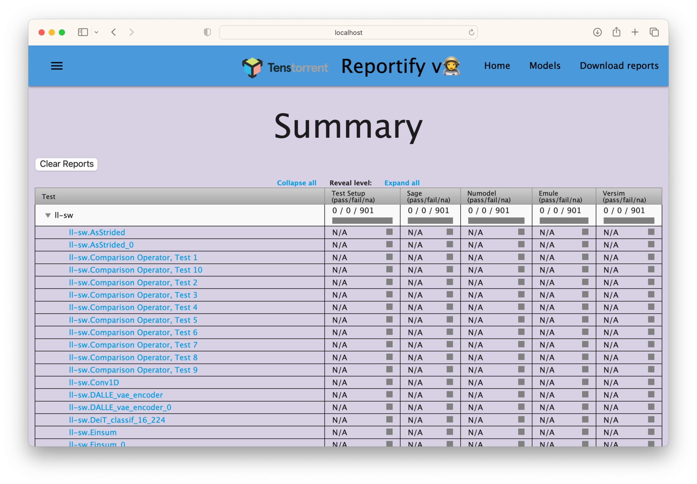

When you go to the reportify address in your browser, you'll get the above landing page.  Each row entry represents a different module compilation or test, note that successive compilations clobber previous results.

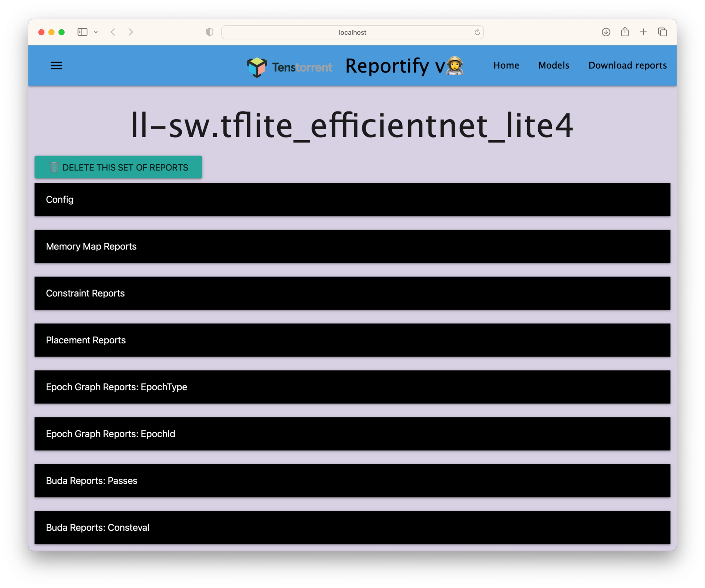

Clicking on a row brings you to a list of report types associated with this compilation.  The 2 most common report types that are used are typically *Buda Reports: Passes* and *Placement Reports*.

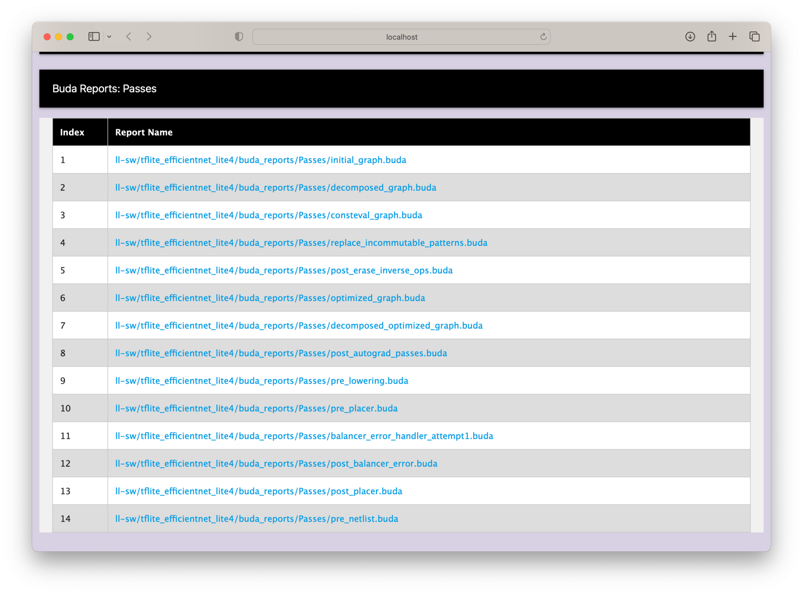

When clicking on the *Buda Reports: Passes* tab, we get a dropdown list of different graph passes to look at.  Each entry corresponds to a high level graph pass that the compiler ran and generated a report for.  We'll look in detail at 2 of the graph passes, *initial_graph* and *post_placer*.

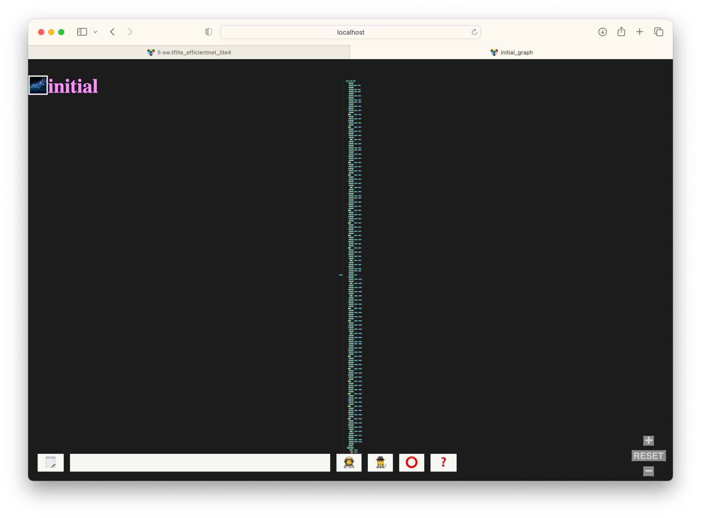

When you first click on a graph to visualize, reportify will be fully zoomed out to fit the entire graph inside the window.  Point your cursor to a section of graph you wish to zoom into and use the scroll wheel to zoom.

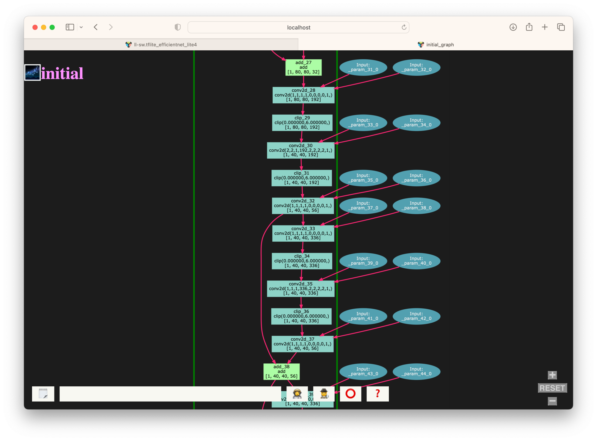

Here we can better see a section of the initial graph.  The initial graph is less of a graph pass and is rather a direct representation of the initial graph data structure that the compiler generated from tracing the module.  Graph input and output queues are typically drawn with ovals, light blue for activations and dark blue for parameters. Operations in the graph are denoted by rectangles and are annotated with the op's name, internal compiler attributes associated with this op, and lastly the op's shape in brackets.

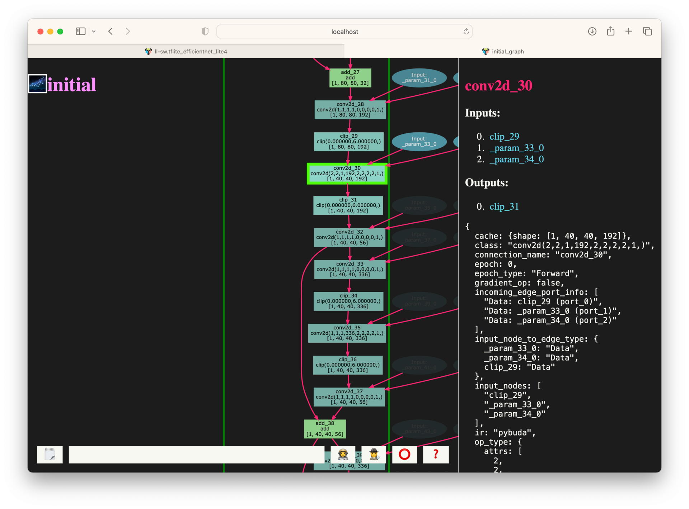

Clicking on a node in the graph brings up a dialog with tons of additional information and metadata about the node.

Let's step out of the initial graph, and next take a look at another important graph pass, *post_placer*.

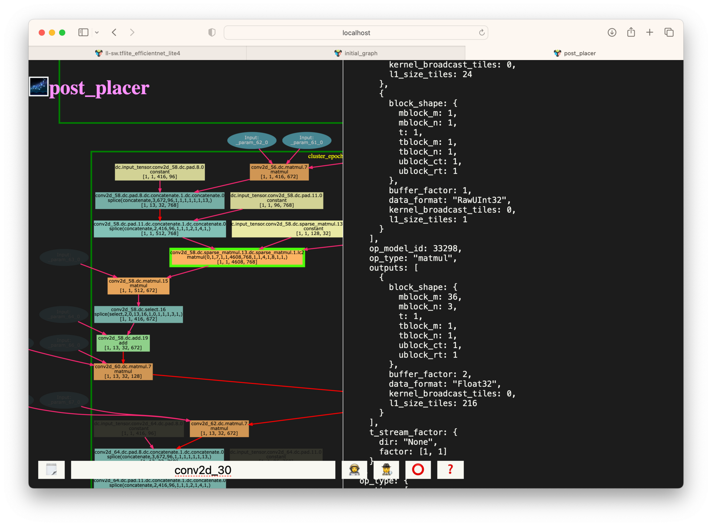

The post-placer graph is at the other end of the spectrum from the initial graph, this represents the fully lowered and placed graph. Here, I've already zoomed into an area of subgraph and clicked on a node.  This graph is particularly useful for gathering additional metadata about the placement, low level blocking and tile allocation amounts for each op.  This data is directly used to populate the netlist yaml, the IR format passed to the backend during the final compilation step.

**Placement Reports**

Ok, let's step back to the report type's page and this time take a look at a different report type, *Placement Reports*.

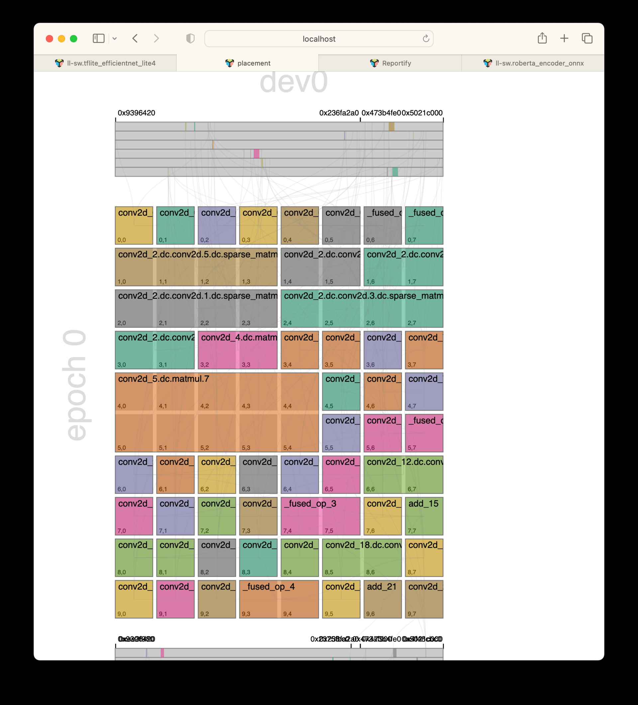

This report type displays a top level view of the device grid and how operations have been placed with respect to each other.  We can see the orange matmul in the middle has been placed onto a 2x5 grid, meaning it uses 10 cores worth of resources during this epoch execution, whereas, most other ops on this epoch are on a 1x1 grid, using only a single core.

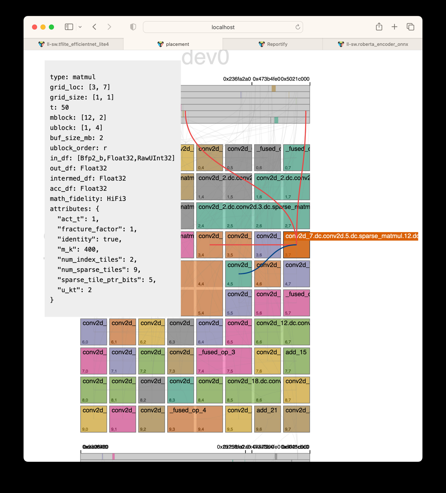

When hovering over an op with your cursor, a dialog pops up with all of the netlist information about this op.  The input edges, in orange, and output edges, in blue, are also highlighted to visualize the source and destinations of data with respect to this op.  This UI is incredibly useful to see what placement decisions the compiler made.

Perf Analyzer (Terminal App)
----------------------------

.. image:: images/perf_analyzer_summary.png 
   :alt: Perf Analyzer 

**Overview**

With the environment variable `TT_BACKEND_PERF_ANALYZER`, we can collect some very detailed information about op and pipe performance on silicon. This app helps by providing:

* Data collected from multiple sources, presented in an interactive tabular form within a terminal
* Quick epoch and model overview to highlight problem areas immediately
* Highlighting of problem areas - very low utilization, bad u_kt choice
* A way to save performance data into a single file for off-line analysis

**Usage**

To generate data used by the app, run any pybuda test with PYBUDA_OP_PERF=1 and TT_BACKEND_PERF_ANALYZER=1 env variables. PYBUDA_OP_PERF=1 is optional, and not available if a test is run from backend only (please ensure that you don't have a leftover op_perf.csv file lying around in that case, as the app will try to pick it up).
Alternatively, if using pybuda benchmark.py, run with --perf_analysis to automatically set the above env variables.
Once the data has been generated, run the analysis app and give it the netlist name:

.. code-block:: bash

  pybuda/pybuda/tools/perf_analysis.py -n your_netlist.yaml

The app will look for performance data in tt_build, and op_perf.csv in the current directory. This corresponds to a typical pybuda test or model run, and should work for the backend runs, too, minus the op_perf.csv file.
Use --save to save data to a binary file, and then subsequently run with --load from any other location or machine.
Full set of command line options is below:

.. code-block:: bash

  usage: perf_analysis.py [-h] [-n NETLIST] [-s] [--save SAVE] [--load LOAD]

  Perf analyzer collects performance data from various sources and displays it in terminal. To use, run any pybuda test with PYBUDA_OP_PERF=1 and TT_BACKEND_PERF_ANALYZER=1 switches to generate
  data, and then run this script in pybuda root, providing the netlist.

  optional arguments:
    -h, --help            show this help message and exit
    -n NETLIST, --netlist NETLIST
                          Model netlist
    -s, --spatial_epochs  Show individual spatial epochs instead of temporal ones. Caution - overall performance estimate on multi-chip runs will not be accurate in this mode.
    --save SAVE           Save collected data into provided file
    --load LOAD           Load data from a previously saved file, instead of from current workspace

**UI**

Most of the data is presented in tables. The app will use the available terminal size, and will automatically fill the window as it is resized. Columns and rows that don't fit on the screen are
not shown, but arrow keys can be used to scroll through the data to show what doesn't fit. Op names
are shortened to about 50 characters, but pressing F will toggle the full names.
Pressing 'H' will open up a help window with more information about the current screen.

**Summary**

The app initially opens up in the summary screen:

.. image:: images/perf_analyzer_summary.png 
   :alt: Perf Analyzer Summary

*Note: Most of this information can be seen inside the app by pressing the 'H' key for help*

At the top, the screen shows the netlist name, and approximate performance and utilization calculated from the collected data.
The overall performance of the model is based purely on the slowest ops in each epoch. Assuming the batch number is high enough to make epoch reconfiguration and pipeline fill/drain negligible, and that there are no major delays due to data transfer between host and the device, this should be a reasonable, albeit slightly optimistic, approximation. The overall utilization is similarly calculated using math utilizations measured on each core and could be optimistic if other delays are not negligible.
A known limitation is that current backend measurement doesn't take into account fork-join delays, so if overall performance, or a particular epoch performance here looks much better than the real measured time, it could be a sign of a fork-join problem.
The fields in the summary table are:

* cycles: Pipeline stage cycles, i.e. the cycles of the slowest op
* speed: The number of inputs/s this epoch is processing
* util: The math utilization of the pipeline this epoch, in steady state
* mm cores: The number of cores occupied by matrix multiplication ops
* balancer util: Similar to util, but calculated using estimated op speeds given to the compiler/balancer. This measures how well balancer did its job, given the information it was given.

**Epoch Analysis**

Pressing 'N' moves to the user to the next epoch, or, if on the summary screen, first epoch. Alternatively, pressing 'E' lets you enter the epoch number and jump to it directly.

*Note: Most of this information can be seen inside the app by pressing the 'H' key for help*

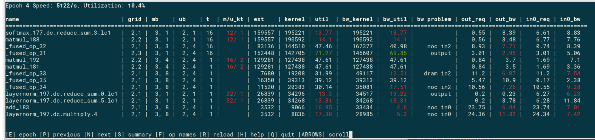

This window shows op performance and utilization for each op in the current epoch. Use P/N keys to move to previous/next epoch, and arrow keys to scroll the rows and columns of the table if it doesn't fit on the screen. Use F to toggle between full op names and shortened version.
The performance values in the table are measured on silicon using backend perf analyzer. The table is sorted with the slowest op at the top.
Some of the key fields in the table are:

* est: The estimated cycles for the op, given to the compiler/balancer.
* kernel: The measured time kernel took to execute, with infinite input/output bandwidths.
* bw_kernel: The measure time for the kernel with real pipes feeding data in/out of the core. This is the "real" time it took for the op to complete.
* bw problem: Identifies the cause of the bw slowdown - input vs output pipe, and if input, then noc vs dram
* in/out columns: Bandwidths, in bytes/cycle, required for the kernel to run at full speed, and measured with real pipes.

*Note: A known limitation is that current backend measurement doesn't take into account fork-join delays, so if overall performance, or a particular epoch performance here looks much better than the real measured time, it could be a sign of a fork-join problem.*

**Example Workflow / Compiler Feedback**

Let's consider an example performance report:

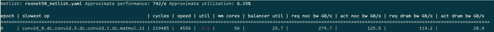

Let's look at this initial epoch:

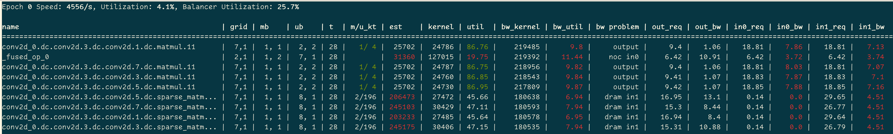

Just taking a look down the ``kernel`` column here we can see that ``_fused_op_0`` took 4-6x longer to execute that all other ops on this epoch, so this is definitely something we should look into.  Let's take a look at the placement report for this epoch:

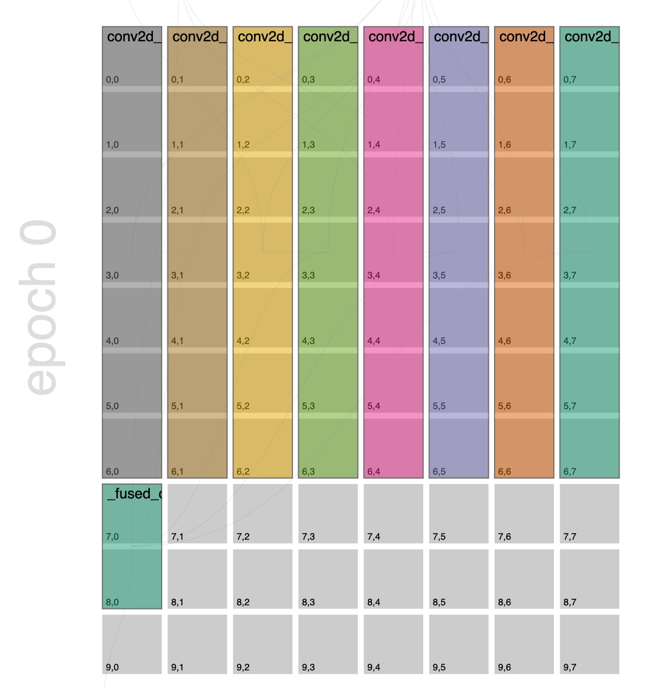

``_fused_op_0`` we can see in the bottom left hand corner on the 2x1 grid.  If we hover over this op we can see its connections:

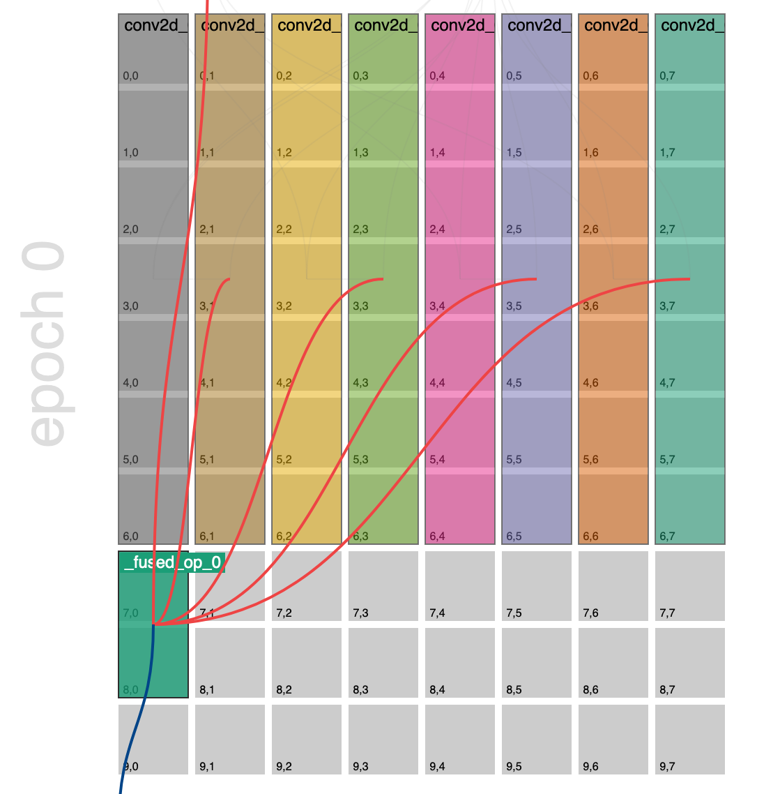

We can see that this op is gathering from 4 different producer ops, so we'd really like to make this fused op run at around the same speed so that it' able to keep up with its producers.  From a data movement perspective, this is also not great because the producer cores are on a 7x1 grid and this consumer is on a 2x1 grid.  If we mentally map how the tensor has be chunked onto the producer core grid, i.e. 7 chunks vertically, and then how this maps to the consumer core, i.e. 2 chunks vertically, each consumer core will have to do a lot of gathering.  Specifically, in this example, each consumer core will have to gather across 3.5 producer cores respectively in order to reconstruct the input tensor for this operation.  As a general rule of thumb, the closer to a 1-1 mapping of producer cores to consumer cores the better for data movement.  In BUDA we call this mismatch in core grids (and block shapes) between producer/consumer pairs *reblocking*. So more accurately, data movement is most efficient when the amount of *reblocking* (mismatch in grids and block shapes) is minimized.

So what to do now?  In looking at the placement report we can see that there is a ribbon of ops along the top 7 rows, because of this these ops are balanced for the 2 reasons we discussed previously, 1) their kernel execution times are balanced because all ops have the same number of core resources allocated to them and 2) reblocking has been minimized because their core grids and block shapes match (note: block shapes can be seen by inspecting the netlist or hovering over the op in the placement graph).  Ideally, if we had another column on the device grid, we could also place ``_fused_op_0`` just to the right of the next op and also give it a 7x1 core grid.  However, we do not, but we do have a bunch of available cores along the bottom.  We can use 2 compiler overrides to reclaim those cores for our ``_fused_op_0``.

.. code-block:: python

  # Ask the compiler to only consider grid shapes of 7x1 for _fused_op_0
  pybuda.config.override_op_size('_fused_op_0', (7, 1))
  # Ask the compiler to transpose the op grid, effectively swapping the rows and columns of the grid orientation
  pybuda.config.override_op_placement('_fused_op_0', transpose_op=True)

After rerunning the test, let's refresh our placement report and take a look if our settings took effect:

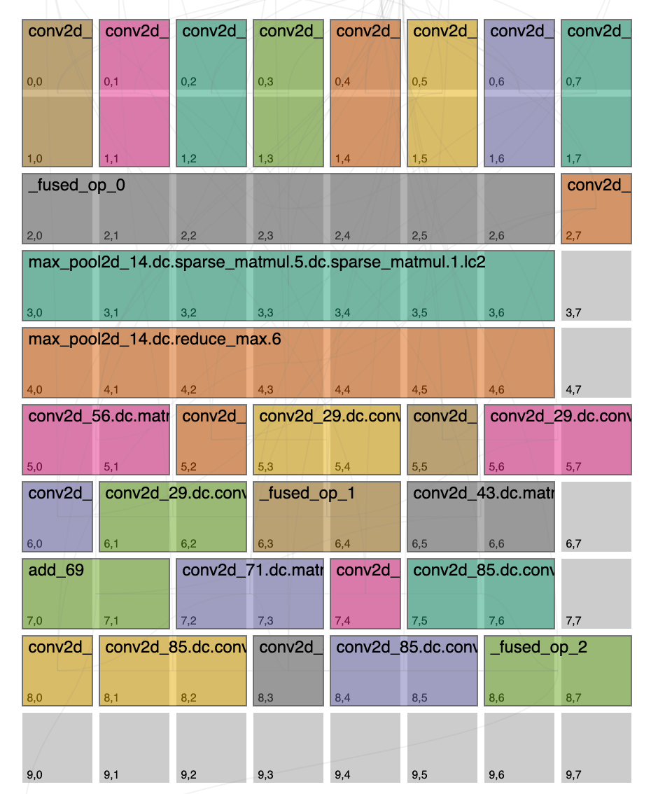

Things look quite different!  First let's notice that ``_fused_op_0`` is on a transposed 7x1 grid, so our override worked.  But also notice that this decision had a cascading effect, after we chose this the compiler realized that in order to be balanced we can actually give fewer cores to the producer operations preceding the ``_fused_op_0`` and that it was now better to minimize reblocking on the *outgoing* edges from the fused op into the max pool operation which can now fit on this epoch.  This outlines a complicated tradeoff that the compiler needs to calculate, is it better to assign more cores on average for all ops and have more epochs, or is it better to assign fewer cores on average for all ops and have fewer epochs.  Even within an epoch there's many decisions to be made, i.e. which edges will have the most impact by optimizing for their data movement, often times this is to the detriment of another op or connection.

So did we do better?  From the summary view we can see that this override changed the network from running at ``742 samples/sec`` to ``1105 samples/sec``, so ~1.5x speedup overall.

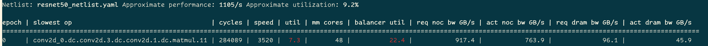

Let's jump into epoch 0 and take a closer look:

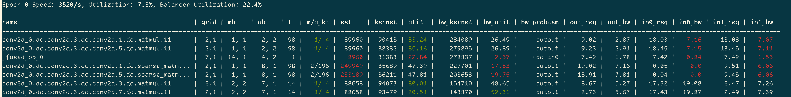

A couple of interesting things to note, ``_fused_op_0`` is now too fast, it's kernel execution time lower than its immediate connections so it'd almost certainly be better to reduce this now.  We should also note that overall, epoch 0 is actually executing *slower*, but we were able to fit many more ops on this epoch (seen in the placement graph above) so overall this was a net win.

Now, we could stop here, but it's often interesting to try many experiments.  We might be happy with our original graph, with the exception of the fused op, we can get back to something closer to our original placement by being more explicit:

.. code-block:: python

    pybuda.config.override_op_size('conv2d_0.dc.conv2d.3.dc.conv2d.1.dc.sparse_matmul.9.dc.sparse_matmul.1.lc2', (7, 1))
    pybuda.config.override_op_size('conv2d_0.dc.conv2d.3.dc.conv2d.1.dc.matmul.11', (7, 1))
    pybuda.config.override_op_size('conv2d_0.dc.conv2d.3.dc.conv2d.3.dc.sparse_matmul.9.dc.sparse_matmul.1.lc2', (7, 1))
    pybuda.config.override_op_size('conv2d_0.dc.conv2d.3.dc.conv2d.3.dc.matmul.11', (7, 1))
    pybuda.config.override_op_size('conv2d_0.dc.conv2d.3.dc.conv2d.5.dc.sparse_matmul.9.dc.sparse_matmul.1.lc2', (7, 1))
    pybuda.config.override_op_size('conv2d_0.dc.conv2d.3.dc.conv2d.5.dc.matmul.11', (7, 1))
    pybuda.config.override_op_size('conv2d_0.dc.conv2d.3.dc.conv2d.7.dc.sparse_matmul.9.dc.sparse_matmul.1.lc2', (7, 1))
    pybuda.config.override_op_size('conv2d_0.dc.conv2d.3.dc.conv2d.7.dc.matmul.11', (7, 1))
    pybuda.config.override_op_size('_fused_op_0', (7, 1))
    pybuda.config.override_op_placement('_fused_op_0', transpose_op=True)

We refresh our placement graph and see:

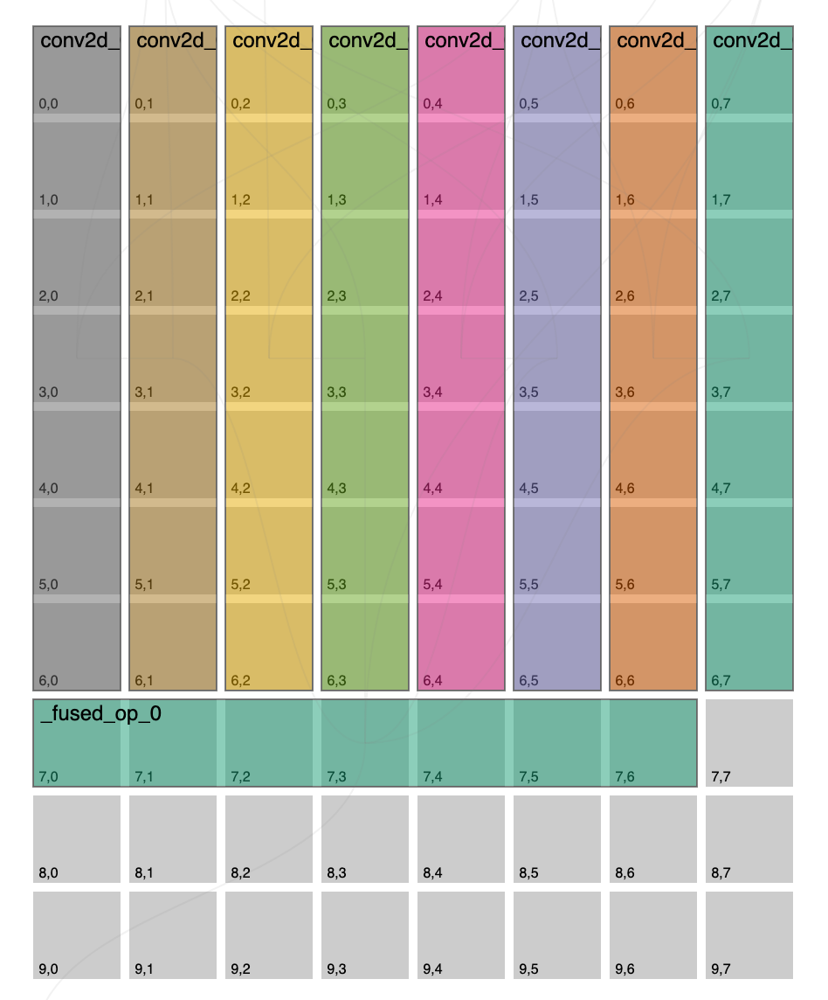

Now we really have what we originally intended to try, but how did we do?  Let's look at perf analyzer again:

.. image:: images/perf_analyzer_summary_explicit.png
   :alt: Perf Analyzer Summary Explicit

Overall we're at ``763 samples/sec`` so not much better from our original ``742 samples/sec``.  Let's look at the epoch we changed:

.. image:: images/perf_analyzer_epoch_0_an_explicit.png
   :alt: Perf Analyzer Summary Explicit

Alright so looking at the ``kernel`` column we're looking much better, if we look at this epoch runtime we're at ``5642 samples/sec`` so much better than originally at ``4556 samples/sec``.  So then why did our previous attempt do so much better?  We need to take a step back and take a look at the execution as a whole, across all epochs.  It turned out to be better to have a slower epoch 0 if it meant we could squeeze more ops onto it, this then allieviates future epochs from having to do more work, or potentially eliminates entire epochs that would have existed.

Some key takeaways from this workflow include:

* Kernel runtimes within an epoch should be balanced and can be manually tweaked by overridding grid size.
* Efficient data movement can be achieved by minimizing reblocking by using grid size and placement overrides.
* Performance issues/differences can be reasoned about, by running multiple experiments, comparing results, and looking at the placement solution holistically.

DeBUDA (Low level device debug)
-------------------------------

Please reference the official DeBuda documentation `here <http://yyz-webservice-02.local.tenstorrent.com/docs/debuda-docs/debuda_py/index.html>`_.

Comparison To GPU Programming Model
***********************************
Tenstorrent device architecture differs from GPUs in a few fundamental ways, including:

* Memory model:

  * Streaming architecture, no random access pointers.  In fact the BUDA software architecture allows kernels to be written in a way that's entirely decoupled from the way that memory was laid out from the producer core.  This completely alleviates kernel variation explosion.
  * Kernel threading is abstracted away, instead kernels are written as though they are executing sequentially on a single core.

* Execution model:

  * Tile based operations, tenstorrent HW works on 32x32 local chunks of data at a time.
  * SFPU HW provides SIMD like programming model.
  * The amount of parallelism can be decided on a per-op level enabling larger ops to use more resources and lighter ops to use fewer resources.

* Scalability:

  * Same compiler for 1x1 device grid configuration can be scaled up to galaxy sized systems, 1000s of cores.
  * No need to support custom model types / manual model fracturing.
  * No kernel explosion, having to write the same kernel for all kinds of different access patterns.
