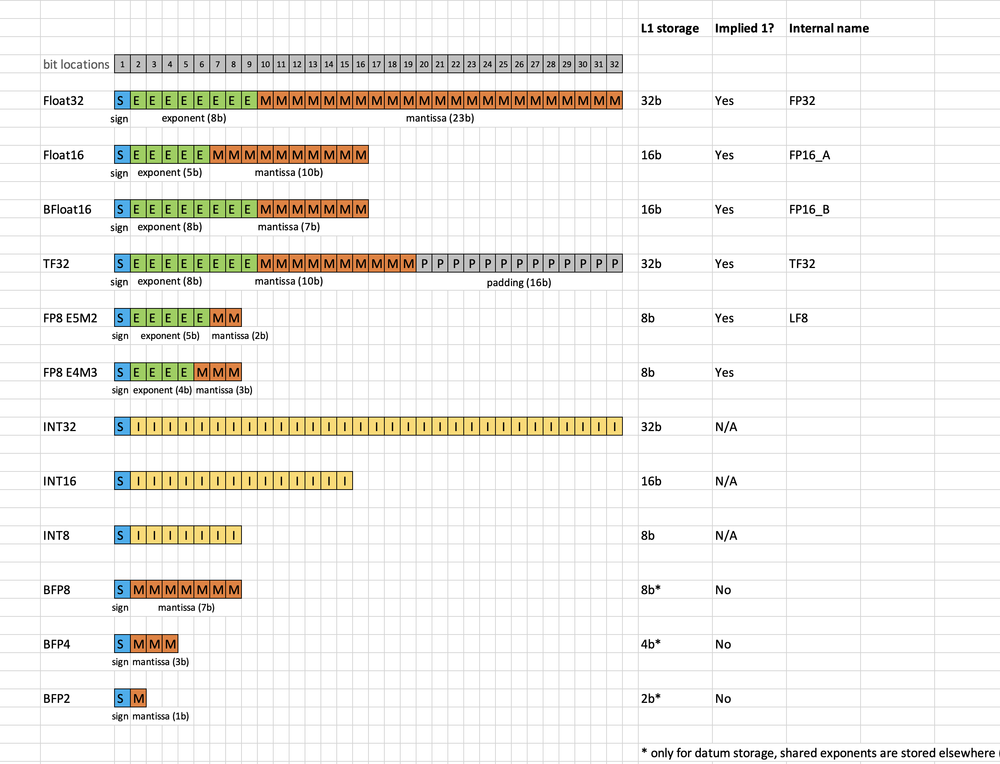
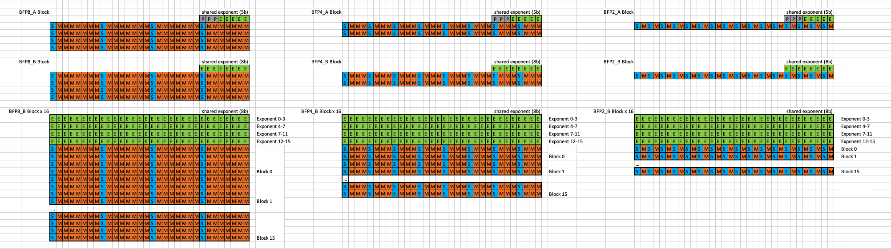

Data Formats and Math Fidelity
==============================

Data Formats
************

Tensix Data Format Support
--------------------------

Table below illustrates the various data formats supported by Tensix Unpacker/Packer:

+-----+--------+-------+------+----------+-----------+-----------------+----------------+
| No. | Format | Sign  | Exp  | Mantissa | Magnitude | Shared Exponent | Floating Point |
+=====+========+=======+======+==========+===========+=================+================+
| 1   | FP32   | 1-bit | 8-bit| 23-bit   | N/A       | No              | Yes            |
+-----+--------+-------+------+----------+-----------+-----------------+----------------+
| 2   | TF32   | 1-bit | 8-bit| 10-bit   | N/A       | No              | Yes            |
+-----+--------+-------+------+----------+-----------+-----------------+----------------+
| 3   | FP16-A | 1-bit | 5-bit| 10-bit   | N/A       | No              | Yes            |
+-----+--------+-------+------+----------+-----------+-----------------+----------------+
| 4   | FP16-B | 1-bit | 8-bit| 7-bit    | N/A       | No              | Yes            |
+-----+--------+-------+------+----------+-----------+-----------------+----------------+
| 5   | LF8    | 1-bit | 5-bit| 2-bit    | N/A       | No              | Yes            |
+-----+--------+-------+------+----------+-----------+-----------------+----------------+
| 6   | INT32  | 1-bit | N/A  | N/A      | 31-bit    | N/A             | No             |
+-----+--------+-------+------+----------+-----------+-----------------+----------------+
| 7   | INT16  | 1-bit | N/A  | N/A      | 15-bit    | N/A             | No             |
+-----+--------+-------+------+----------+-----------+-----------------+----------------+
| 8   | INT8   | 1-bit | N/A  | N/A      | 7-bit     | N/A             | No             |
+-----+--------+-------+------+----------+-----------+-----------------+----------------+
| 9   | BFP8-A | 1-bit | 5-bit| 7-bit    | N/A       | Yes             | Yes            |
+-----+--------+-------+------+----------+-----------+-----------------+----------------+
| 10  | BFP8-B | 1-bit | 8-bit| 7-bit    | N/A       | Yes             | Yes            |
+-----+--------+-------+------+----------+-----------+-----------------+----------------+
| 11  | BFP4-A | 1-bit | 5-bit| 3-bit    | N/A       | Yes             | Yes            |
+-----+--------+-------+------+----------+-----------+-----------------+----------------+
| 12  | BFP4-B | 1-bit | 8-bit| 3-bit    | N/A       | Yes             | Yes            |
+-----+--------+-------+------+----------+-----------+-----------------+----------------+
| 13  | BFP2-A | 1-bit | 5-bit| 1-bit    | N/A       | Yes             | Yes            |
+-----+--------+-------+------+----------+-----------+-----------------+----------------+
| 14  | BFP2-B | 1-bit | 8-bit| 1-bit    | N/A       | Yes             | Yes            |
+-----+--------+-------+------+----------+-----------+-----------------+----------------+

- Formats 1-5 are floating point formats
- Formats 6-7 are integer formats
- Formats 9-14 are floating point formats with a shared exponent – called Block Floating Point (BFP) formats

Data Format Breakdown
---------------------

Block Floating Point
********************

BFP Breakdown
-------------

Block Floating Point (BFP) support different element sizes by varying the # bits used for the mantissa, BFP8/4/2 support 8b/4b/2b elements respectively. 

The exponent is always shared across all elements in a block of 16 elements. Shared exponent supports A (5b padded to 8b) and B (8b) formats. The reason for an A format is to support compatibility with other 5b exponent formats such as Float16.

BFP Data Conversion
-------------------

When converting from Float to BFP. The shared exponent is calculated as follows:
1. Organize the data into 16-element blocks
2. Locate the next block to be converted
3. Find the maximum exponent across all elements in the block, append it to the shared exponent section
4. Left append 1 to each element's mantissa to make the implied 1 explicit
5. Calculate the exponent delta between the maximum exponent and the exponent of each element in the block
6. Right shift the mantissa by the exponent delta
7. Truncate bits to fit in the BFP format mantissa size, optionally round before truncation
8. Append the converted BFP block of elments to the data section
9. Repeat from step 2 until all blocks are converted

Block Storage Efficiency
------------------------

Exponent section overhead remains the same across BFP8, BFP4, BFP2. Data section size reduces by 2x for every 2x reduction in element size (BFP8->BFP4->BFP2).

Math Fidelity
*************

Math Fidelity defines the number of phases being used to compute a high-precision multiplication using four low-precision multiplications. The higher the math fidelity, the more accuracte the result, but also the more compute cycles that are required. The supported fidelity phases range from lowest to highest: `MathFidelity.LoFi`, `MathFidelity.HiFi2`, `MathFidelity.HiFi3`, `MathFidelity.HiFi4`. 

These fidelity phases map to the order that the mantissa bits are consumed from the inputs on SrcA and SrcB from Most Significant Bit (MSB) to Least Significant Bit (LSB):

- Fidelity Phase 0 (`MathFidelity.LoFi``): SrcA MSBs, SrcB MSBs
- Fidelity Phase 1 (`MathFidelity.HiFi2`): SrcA LSBs, SrcB MSBs
- Fidelity Phase 2 (`MathFidelity.HiFi3`): SrcA MSBs, SrcB LSBs
- Fidelity Phase 3 (`MathFidelity.HiFi4`): SrcA LSBs, SrcB LSBs
