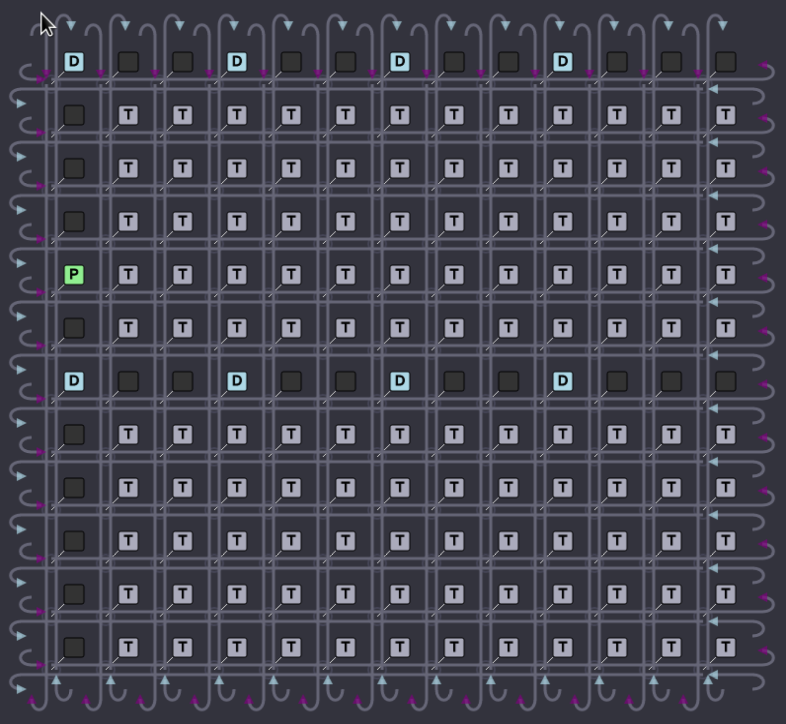

Hardware Overview
=================

In order to get the most out of Buda, it is important to have a basic understanding of Tenstorrent hardware. 

A typical Tenstorrent chip is divided into a rectangular grid of compute cores, called Tensix |tm|. The :ref:`Tensix` cores are connected with two torus-shaped :ref:`NOC`, going in opposite directions. Some
locations in the grid are dedicated to non-compute functionality, such as DRAM, PCIe, and Ethernet interfaces, and some are left empty. Below is the illustration of :ref:`Grayskull` |tm| grid, which is the
first-generation Tenstorrent chip.

Each Tensix core contains a high-density tensor math unit (FPU) which performs most of the heavy lifting, a SIMD engine (SFPU), five Risc-V CPU cores, and a large local memory storage (:ref:`L1`). A typical
FPU math operation has one or two operands which are read (:ref:`unpacked<Unpacker>`) from local memory into source registers, and the computed results are written and accumulated to destination registers, until explicitly copied
(:ref:`packed<Packer>`) to local memory. NOC is programmed with connections (*pipes*) between cores so that outputs of one operation are automatically pushed to the next operation that needs them.

.. |tm|   unicode:: U+02122 .. TM SIGN

