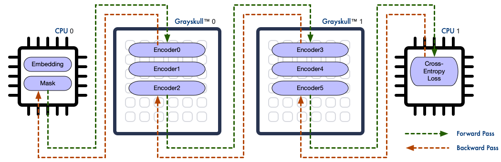

PyBuda
======

PyBuda is a Python-based machine learning framework for describing and placing a pipeline of modules on one or more CPU and Tenstorrent devices. While PyBuda makes it
as easy to describe and run an ML model on a device as you would expect from a modern machine learning framework, PyBuda excels at making it easy to run a large model over
a heterogeneous pipeline of CPU and Tenstorrent devices. With just a few lines of code, PyBuda can set up a training pipeline like in the diagram below, setting up all
inter-process and inter-device communications automatically, so that the user can focus on their workload instead of the plumbing.

PyBuda provides a set of operations and classes for describing ML models that should be familar to current users of PyTorch. In addition, PyBuda provides a set of APIs
with access into the compiled model database, allowing users to query and tune the compiled design's performance, pipeline balance, placement, routing, and other parameters. This
gives the user complete control over the low-level performance of their model, allowing them to get the most of the available hardware.

In current version of PyBuda, CPU devices in the pipeline can execute PyTorch modules, and Tenstorrent devices can execute modules 
written in PyBuda. In the near future, both kinds of modules will be able to run on either device. 

To learn more PyBuda, select one of the pages below:

.. toctree::
   :maxdepth: 2

   first_model
   training
   debug

